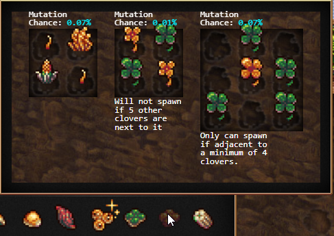

# Charting Mutations
This is a mod that creates and displays a very handy mutation chart designed to show you how to grow seeds in order to mutate them into your desired seed.<br>
This will reveal all locked seeds but won't allow you to plant them. If you'd like to see the <i>Mutations Chart</i> on an already unlocked seed, just hold down SHIFT or CTRL and it will swap to tooltips.



## To Install:

### Bookmarklet

Copy this code and save it as a bookmark. Paste it in the URL section. To activate, click the bookmark when the game's open.

```javascript
javascript: (function () {
  Game.LoadMod('https://frustrated-programmer.github.io/ChartingMutations/ChartingMutations.js');
}());
```

If (for some reason) the above doesn't work, trying pasting everything after the <code>javascript:</code> bit into your browser's console.

### Userscript

If you'd rather use the addon as an [userscript](https://en.wikipedia.org/wiki/Userscript) to automatically load _Charting Mutations_ every time the original game loads, install the `ChartingMutations.user.js` file. You can do this by clicking on the file in the file-list and clicking "raw" to get the necessary code to copy over into your userscript.

### Steam

I don't OWN the Steam version, so I've just worked with the documentation. This should work with Steam version but I cannot test it myself. But I did receive someone who reached out to let me know it does work!
1. Download the `steam-mod` folder included in this repo.
2. Move the folders of the mods you want into `<yoursteaminstall>\SteamApps\common\Cookie Clicker\resources\app\mods\local`, you can get to this from the mods menu.
3. Enable them in-game with the mods menu.

## Files:
* `SeedShower.js` is just the source code.
* `SeedShower.main.js` is everything you need if you want to have the source code loading inside an extension.
* `SeedShower.user.js` is the recommended userscript you can use to load Charting Mutations and keep it up to date.

# Todo
This is a just passion project of mine. These are my ideas for how to improve. But without some donations or incredible recognition, I probably won't implement these. Feel free to make a PR I'll probably accept it.

* Add a new garden tool, that freezes the garden and then you can hover over tiles to discover what can spawn there.
* Add a setting called No-Cheat, that disables revealing the locked seeds to allow new players to discover the garden naturally.
* Add a setting to disable the animations
* Randomize plant's locations in the chart.

# Check out my OTHER mod!

## <a href="https://github.com/Frustrated-Programmer/BuildingSorter">Building Sorter</a>
<a href="https://github.com/Frustrated-Programmer/BuildingSorter"></a>
